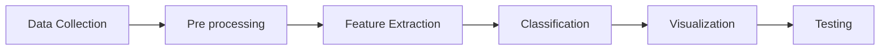

# Paper Review 

## Sentimental Analysis Using Supervised Learning Algorithms 

The [paper](https://ieeexplore.ieee.org/stamp/stamp.jsp?tp=&arnumber=9990320) summarizes the approaches to the Sentimental Analysis Task in the literature.
The steps usually followed are

The models mentioned for the `classification` tasks are:
- **Support Vector Machine**
- **Neural Network**
    1. Convolutional neural network-
    Convolutional neural networks are generally used for problems like digital image processing. For example- Hand digit recognition system, Vehicle detection system, Plant disease detection system.
    2. Artificial neural network-
    An artificial neural network is related to models where the classification is based on past data and also prediction. For example- Stock value prediction.
- Decision Trees
- **Naive Bayes**. Naive Bayes algorithm uses the concept of probability at the token level in order to calculate and efficiently classify data as a positive or a negative sentiment.
- **Maximum Cross entropy**.
This algorithm also supports a probabilistic approach like the Naive Bayes algorithm. The main difference is to maintain a set of user extracted features designed and accordingly weights are calculated by the model. 
- **K-NN**.
K-NN works similarly to Naive Bayes algorithm. The main difference lies on the basis of selecting the feature to be chosen as K-NN uses the cosine or the Euclidean distance in order to calculate the nearest neighbor for any node K

With the different supervised algorithms being discussed namely SVM, Neural Network, Decision Trees (DT), Naive Bayes, Maximum Cross entropy, K-NN the DT algorithm provides maximum accuracy and efficiency with highest precision of almost 90% approximately.

## Sentiment analysis using deep learning architectures: a review
The [paper](https://www.semanticscholar.org/paper/Sentiment-analysis-using-deep-learning-a-review-Yadav-Vishwakarma/b1e25e6dcf66029952b4f925c81848c04c97f2b6) reviews different methodologies applied to the task of Sentimental Analysis making use of deep learning.

It starts discussing the taxonomy of SA. 
- **Document Level**: Yang et al. (2016) proposed a hierarchical attention network model that focuses on vital content for constructing the doc- ument representation. SR-LSTM in which the first layer used LSTM to learn the sentence vectors, and second layer encodes the relations between the sentences. A hybrid approach of RBM and Probabilistic Neural Network (PNN) is proposed by Ghosh et al. (2017) in which RBM is used for dimen- sionality reduction, and PNN performs sentiment classification. The proposed approach gave better results on the five datasets compared to the state-of-the-art methods.
- **Sentence-level sentiment classification**: 
Zhao et al. (2017) propose CNN for constructing WDE-CNN and LSTM for constructing WDE-LSTM to extract feature vectors from review sentences. The model was evaluated on Amazon dataset from three domains: digital cameras, cell phones, and laptops. The accuracy obtained on WDE-CNN model was 87.7%, and on WDE-LSTM model was 87.9%, which shows that deep learning models gives highest accuracy as compared to baseline models. Xiong et al. (2018b) developed a model called Multi-level Sentiment-enriched Word Embedding (MSWE), which uses a Multi-layer perceptron (MLP) to model word-level sentiment information and CNN to model tweet- level sentiment information. The model also learns sentiment-specific word embeddings, and SVM is used for sentiment classification. It was evaluated on SemEval2013 dataset and Context-Sensitive Twitter (CST) dataset, which are the benchmark datasets for sentiment classification task. *

For sentence-level sentiment classification and aspect-level sentiment classification, researchers have majorly focused on RNN (particularly LSTM).

*Coupling LSTM and CNN has been provn to be a good idea as CNN can extract the local features in the text, and LSTM can capture the long-term dependencies in sentences.

Attention-based GRU networks are also applied to various sentiment analysis tasks like target based sentiment classification. Zhang et al. (2018b) proposed an approach to model target sentiment classification into Q&A system using Dynamic Memory Networks (DMN).

### **Datasets**
Twitter dataset (You et al. 2016) consists of 220,000 tweets that contain both images and text. Similarly, Tree LSTM with Attention has given the highest accuracy on this dataset.